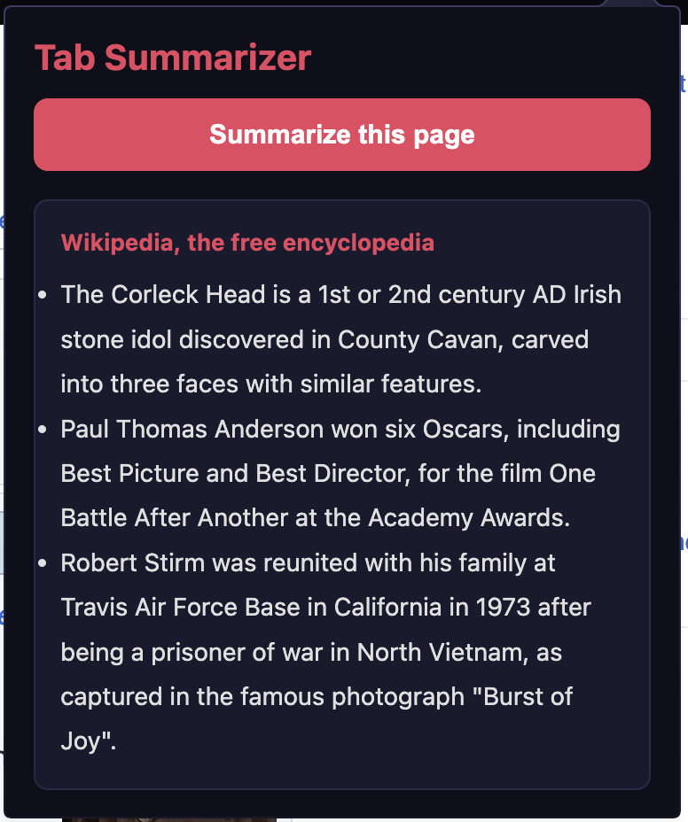

# Tab Summarizer

A browser extension that uses AI to summarize any webpage in 3 concise bullet points. Works on Chrome, Edge, and Opera GX.



## How It Works

1. Click the Tab Summarizer icon in your browser toolbar
2. Click **"Summarize this page"**
3. Get a clean 3-point summary in seconds

The extension extracts the page text and sends it to a Vercel serverless function, which forwards it to the Groq API (powered by Meta's Llama 3.1 8B model) and returns a summary.

## Tech Stack

- **Frontend:** HTML, CSS, JavaScript (Chrome Extensions API - Manifest V3)
- **Backend:** Node.js serverless function hosted on Vercel
- **AI:** Groq API running Meta's Llama 3.1 8B model
- **Compatible browsers:** Chrome, Edge, Opera GX

## Running Locally

### Prerequisites
- A [Groq API key](https://console.groq.com) — free, no credit card required
- A [Vercel account](https://vercel.com) — free
- Git installed

### 1. Clone the repository
```bash
git clone https://github.com/trish51/tab-summarizer.git
cd tab-summarizer
```

### 2. Set up environment variables

Add the following to your Vercel project's environment variables:

| Variable | Description |
|---|---|
| `GROQ_API_KEY` | Your Groq API key |
| `REQUEST_KEY` | A secret string you generate to protect the API endpoint |

### 3. Deploy the Vercel function

Install the Vercel CLI and deploy:
```bash
npm install -g vercel
vercel
```

Follow the prompts. Once deployed, copy your Vercel URL.

### 4. Update the extension

Open `extension/popup.js` and replace the fetch URL and request key:
```javascript
const res = await fetch("https://your-vercel-url.vercel.app/api/summarize", {
    method: "POST",
    headers: {
        "Content-Type": "application/json",
        "x-request-id": "your_request_key_here"
    },
```

### 5. Load the extension in your browser

**Chrome / Edge:**
1. Go to `chrome://extensions` or `edge://extensions`
2. Enable **Developer Mode** (top right)
3. Click **"Load unpacked"**
4. Select the `extension` folder

**Opera GX:**
1. Go to `opera://extensions`
2. Enable **Developer Mode**
3. Click **"Load unpacked"**
4. Select the `extension` folder

## Using the Extension

1. Navigate to any webpage or article
2. Click the **Tab Summarizer** icon in your browser toolbar
3. Click **"Summarize this page"**
4. Wait a moment while the AI processes the page
5. Read your 3-point summary

> **Tip:** Works best on articles, blog posts, and news pages. May not work on pages that restrict content scripts such as browser settings pages.


## Security

The Vercel function is protected by a secret request key passed as a custom header. The Groq API key is stored as a Vercel environment variable and is never exposed to the client.
